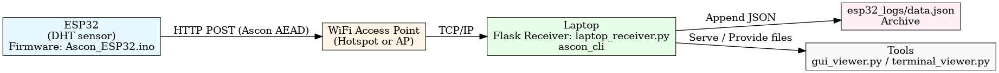
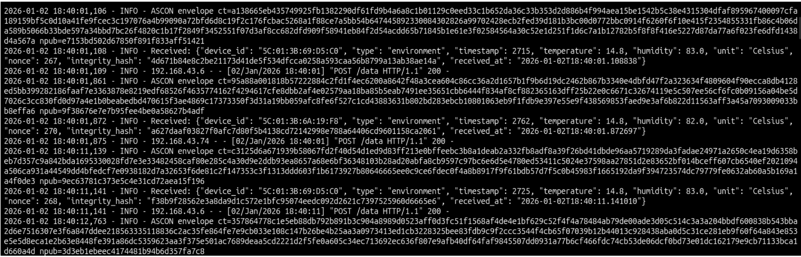
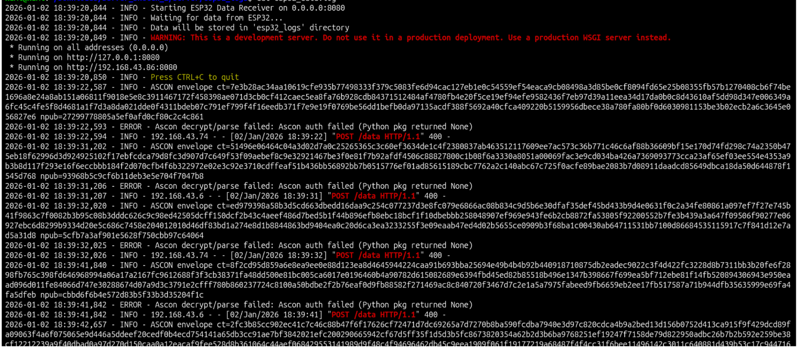
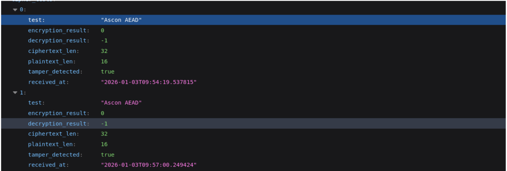
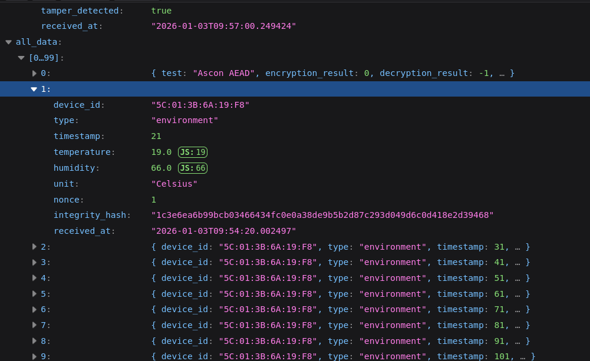
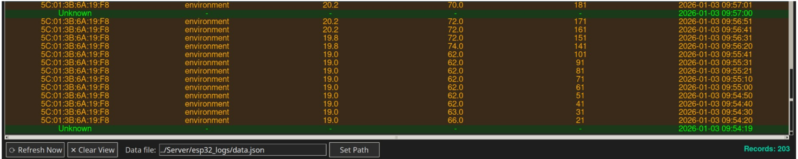

# ESP32 Encrypted Telemetry System

**Secure telemetry transmission from ESP32 sensors to a laptop receiver using Ascon-128a AEAD encryption.**

A complete IoT security solution featuring end-to-end authenticated encryption between ESP32 microcontrollers and a Python-based server, with real-time data visualization tools.


---

## Features

- **Lightweight Authenticated Encryption**: Implements [Ascon-128a](https://ascon.iaik.tugraz.at/) — the NIST Lightweight Cryptography standard winner
- **ESP32 Native Implementation**: Optimized C implementation directly on the microcontroller
- **Integrity Verification**: DJB2-based hash verification to detect tampering
- **Real-time Monitoring**: GUI and terminal viewers for live telemetry data
- **Flexible Architecture**: Supports multiple ESP32 devices with device mapping
- **Arduino IDE Compatible**: Firmware developed and tested with [Arduino IDE 2.x](https://www.arduino.cc/en/software)

---

## Project Structure

```
├── Crypto/              # Ascon encryption C library + CLI tool
│   ├── ascon_cli.c      # Command-line encrypt/decrypt utility
│   ├── core.c           # Ascon core operations
│   ├── encrypt.c        # Encryption implementation
│   ├── decrypt.c        # Decryption implementation
│   └── permutations.c   # Ascon permutation functions
│
├── Firmware/            # ESP32 Arduino firmware
│   └── Ascon_ESP32.ino  # Complete Ascon AEAD + WiFi + DHT sensor
│
├── Server/              # Python Flask receiver
│   ├── laptop_receiver.py   # HTTP server with Ascon decryption
│   ├── device_map.json      # MAC address to device name mapping
│   └── esp32_logs/          # Logged telemetry data (JSON)
│
├── Tools/               # Data visualization utilities
│   ├── gui_viewer.py        # Tkinter GUI for real-time monitoring
│   └── terminal_viewer.py   # Terminal-based log viewer
│
└── Docs/                # Documentation & diagrams
    └── figures/         # Architecture diagrams (Graphviz)
```

---

## Data Flow



---

## Setup Instructions

### Prerequisites

| Component    | Version | Notes                        |
|--------------|---------|------------------------------|
| Python       | 3.8+    | For receiver and viewers     |
| GCC          | Any     | To compile Ascon CLI         |
| Arduino IDE  | 2.x     | For ESP32 firmware           |
| ESP32 Board  | WROOM   | Or compatible variant        |

---

### 1. Compile the Ascon CLI Tool

```bash
cd Crypto/

# Compile all sources
gcc -O2 -o ascon_cli ascon_cli.c core.c encrypt.c decrypt.c permutations.c printstate.c -I.

# Copy to Server directory (required!)
cp ascon_cli ../Server/

# Verify installation
./ascon_cli --help
```

---

### 2. Install Python Dependencies

```bash
# System package for Tkinter GUI
sudo apt install python3-tk    # Debian/Ubuntu
# or: brew install python-tk   # macOS

# Python packages
pip install flask pycryptodome
```

| Package       | Purpose                                 |
|---------------|-----------------------------------------|
| `flask`       | HTTP server for receiving ESP32 data    |
| `pycryptodome`| Fallback crypto (Ascon CLI is primary)  |
| `tkinter`     | GUI viewer (usually bundled with Python)|

---

### 3. Configure the Encryption Key

> **IMPORTANT:** The key must match on both ESP32 and Server!

**Default key (change for production):**
```
00 01 02 03 04 05 06 07 08 09 0A 0B 0C 0D 0E 0F
```

| Location | File | Variable |
|----------|------|----------|
| ESP32    | `Firmware/Ascon_ESP32.ino` | `ASCON_KEY` |
| Server   | `Server/laptop_receiver.py` | `ASCON_KEY` |

---

### 4. Flash the ESP32 (Arduino IDE)

1. Download and install [Arduino IDE 2.x](https://www.arduino.cc/en/software)
2. Open `Firmware/Ascon_ESP32.ino` in Arduino IDE
3. Install ESP32 board support:
   - File → Preferences → Additional Board URLs:
     ```
     https://raw.githubusercontent.com/espressif/arduino-esp32/gh-pages/package_esp32_index.json
     ```
   - Tools → Board → Boards Manager → Search "esp32" → Install
4. Configure WiFi credentials in the sketch:
   ```cpp
   #define WIFI_SSID "Your_SSID"
   #define WIFI_PASSWORD "Your_Password"
   #define SERVER_URL "http://YOUR_SERVER_IP:8080/data"
   ```
---

### 5. Start the Server

```bash
cd Server/
python laptop_receiver.py
```

The server listens on `http://0.0.0.0:8080/data`

---

### 6. Monitor Data

**GUI Viewer:**
```bash
cd Tools/
python gui_viewer.py
```

**Terminal Viewer:**
```bash
cd Tools/
python terminal_viewer.py
```

---

## System Demonstration

This section showcases the ESP32 Encrypted Telemetry System in action, demonstrating data flow, monitoring tools, and security features.

### Flask Server Receiver

The `laptop_receiver.py` server running on the host computer receives encrypted telemetry data from ESP32 devices over HTTP, decrypts it using Ascon-128a, and logs it to JSON files.


---

### Terminal Viewer

Real-time monitoring of encrypted telemetry data via the terminal-based viewer, displaying received sensor readings and processing status.



---

### JSON Log File

Decrypted sensor data is logged in JSON format for audit trails, analysis, and long-term storage. Each entry includes timestamp, device ID, sensor readings, and integrity verification status.


---

### Integrity Check Failures

The system detects and logs instances where message authentication fails, indicating potential tampering or corrupted transmissions.

**Integrity Check Failure in Terminal Output:**



**Integrity Check Failure in JSON Log:**



---

### GUI Viewer

The Tkinter-based GUI viewer provides a user-friendly interface for monitoring multiple ESP32 devices, displaying real-time sensor data in a tabular format with device-specific status indicators.



---

### Failed Integrity Check in GUI

The GUI viewer clearly indicates failed integrity checks with visual warnings, helping operators quickly identify and investigate security anomalies.



---

## Security Overview

### Ascon-128a AEAD
- **Key Size:** 128 bits (16 bytes)
- **Nonce Size:** 128 bits (16 bytes)
- **Tag Size:** 128 bits (16 bytes)
- **Rate:** 128 bits (optimized for authentication)

### Integrity Check
- DJB2 hash with shared key for additional message integrity verification
- Detects any payload tampering before processing

---

## API Reference

### POST `/data`

Accepts encrypted telemetry data from ESP32 devices.

**Request Body (Ascon envelope):**
```json
{
  "algo": "ASCON-128A",
  "ct": "<hex-encoded-ciphertext>",
  "npub": "<hex-encoded-nonce>"
}
```

**Response:**
```json
{
  "status": "success",
  "message": "Data received and logged"
}
```

---

## Development

### Testing Encryption Locally

```bash
cd Crypto/
gcc -o main main.c core.c encrypt.c decrypt.c permutations.c printstate.c -I.
./main
```

### Adding New Devices

Edit `Server/device_map.json`:
```json
{
  "AA:BB:CC:DD:EE:FF": "new-sensor-name"
}
```

---

## License

MIT License — see [LICENSE](LICENSE) for details.

---

## Acknowledgments

- [Ascon Team](https://ascon.iaik.tugraz.at/) — NIST Lightweight Cryptography Standard
- [Espressif](https://www.espressif.com/) — ESP32 Platform
- [Arduino](https://www.arduino.cc/) — Arduino IDE and ecosystem
